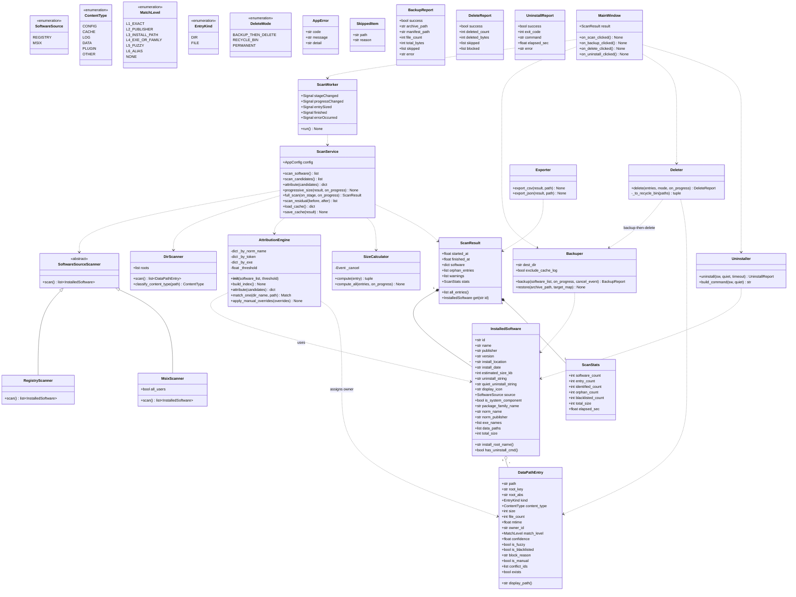
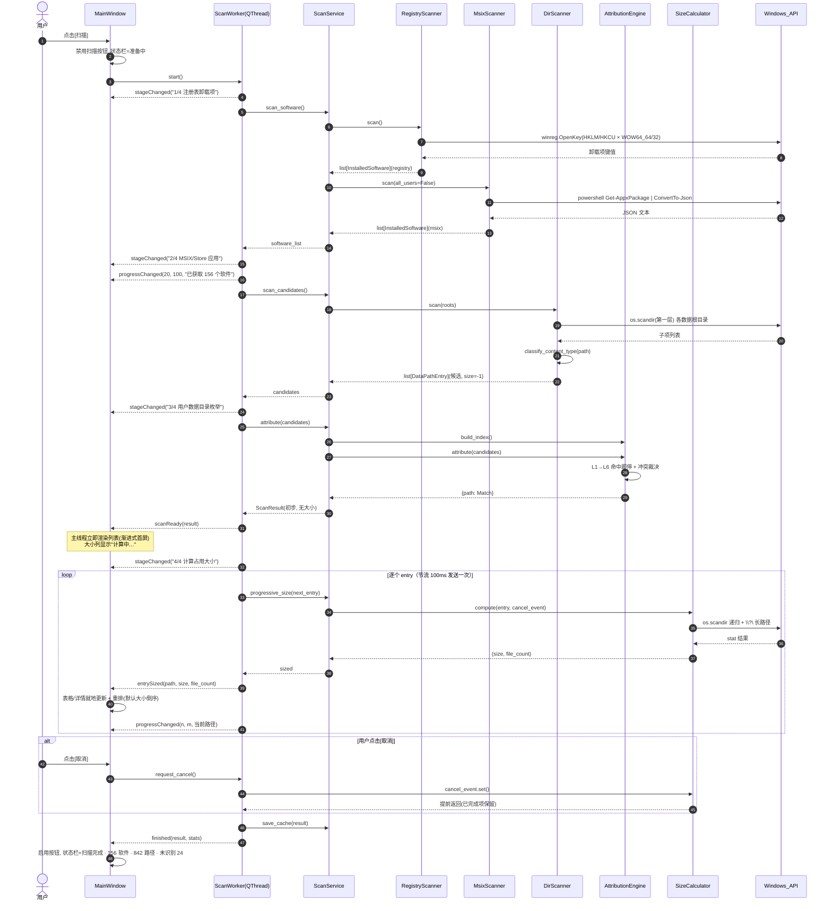
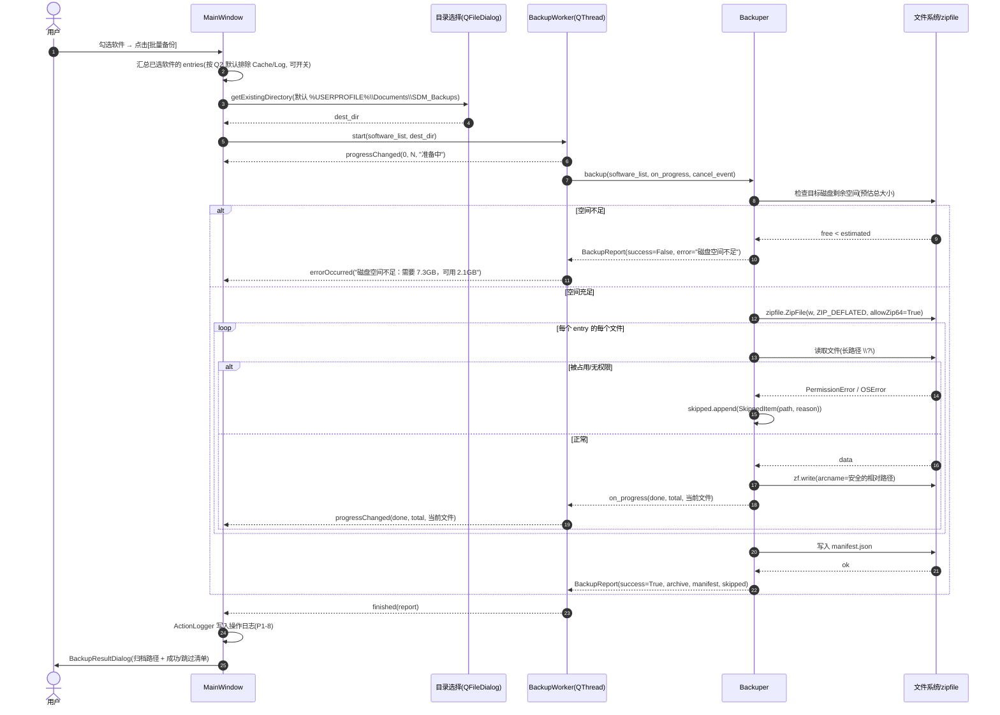
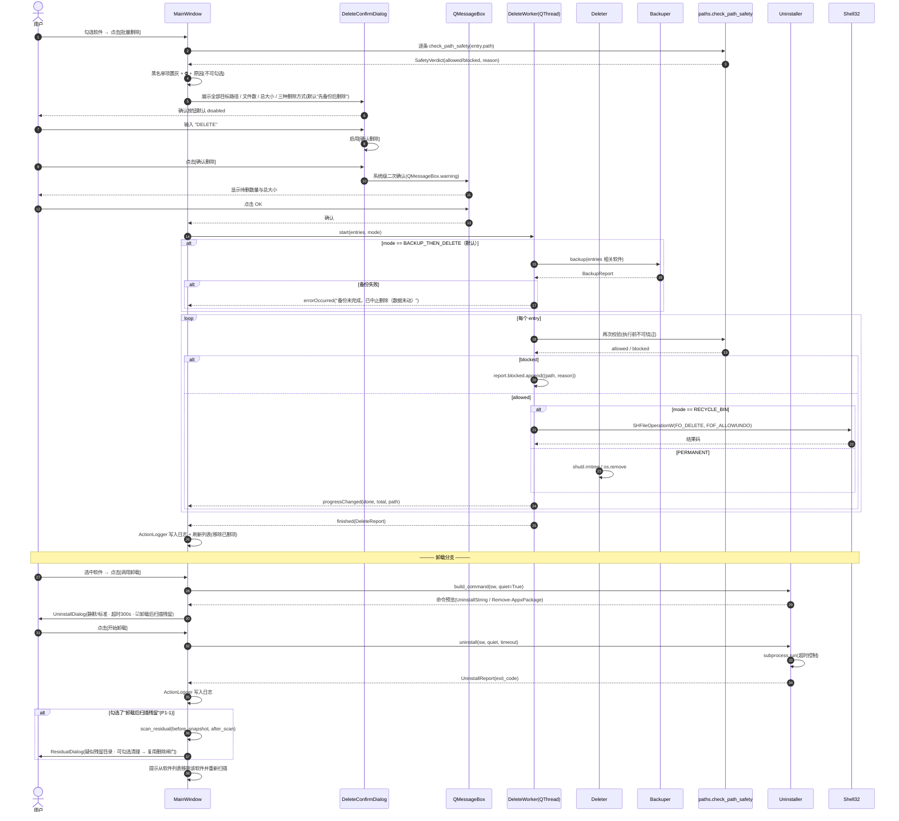

# 系统架构设计说明书 — Software Data Migrator

| 项目信息 | 内容 |
| --- | --- |
| 文档语言 | 中文 |
| 项目名称 | `software_data_migrator` |
| 技术栈 | Python 3.13.14 + PySide6-Essentials 6.8.3（已安装，无需新增第三方依赖） |
| 运行环境 | `C:/Users/seer/.workbuddy/binaries/python/envs/default/Scripts/python.exe`（venv / Windows / 用户名 `seer`） |
| 项目根目录 | `C:/Users/seer/WorkBuddy/2026-09-27-11-55-51/` |
| 上游文档 | `docs/PRD.md`（v1.0） |
| 文档版本 | v1.0 |
| 作者 | 高见远（架构师） |

> 主理人裁决已全部吸收（Q1=zip、Q2=默认排除 Cache/Log、Q3=MSIX 默认当前用户、Q4=渐进式大小计算、Q5=默认先备份后删除、Q6=还原仅留接口、Q7=注册表清理不做、Q8=源码+启动脚本、Q9=仅中文、Q10=跳过并报告）。本文件是这些裁决的技术落地方案。

---

## 1. 实现方案概述

### 1.1 需求难点分析

| 难点 | 本质 | 技术应对 |
| --- | --- | --- |
| **D1 软件清单不全** | 已安装软件来源分裂：Win32（注册表 4 个卸载项根）、MSIX/Store（PowerShell）、用户级安装（无注册表项） | 多源扫描器 + 统一 `InstalledSoftware` 模型；按 `source` 字段区分；扫描器抽象为统一接口，便于后续加 Portable/多用户源（P2） |
| **D2 路径→软件归属推断（核心）** | 目录名与软件名常常不一致（`Code` ↔ `Visual Studio Code`）；不能强行归属；300×2000 组合要在 3s 内算完 | 分级规则 L1→L6 命中即停 + **归一化倒排索引**（先按 token 召回 ≤20 个候选软件，再算相似度），避免 O(N×M) 全量 difflib；输出级别+置信度+冲突标记 |
| **D3 大小计算慢且阻塞 UI** | 递归遍历大目录（Chrome Cache 等）耗时数十秒到数分钟 | 渐进式：先出清单，大小由后台 `QThread` 逐个填充；`\\?\` 长路径前缀；`os.scandir` + 跳过符号链接/挂载点；`threading.Event` 取消；结果落盘缓存 |
| **D4 删除的高危性** | 误删系统目录 = 系统崩溃；用户新手 | 四道闸门：硬黑名单（路径判定）→ 路径清单对话框（黑名单项置灰）→ 输入 `DELETE` 启用按钮 → 系统级 `QMessageBox`；删除策略默认回收站/先备份 |
| **D5 被占用文件 / 权限不足** | 运行中软件锁定文件；系统级目录需管理员 | 备份逐文件 `try/except`，失败进 `skipped` 清单并在结果报告展示；管理员检测用 `shell32.IsUserAnAdmin()`，不足则明确报错并给出提权重启入口 |
| **D6 中文路径与长路径** | 中文用户名 `seer` 无中文，但软件数据目录常含中文；路径 >260 字符 | 全程 `str` + UTF-8；所有磁盘 API 调用前经 `paths.to_long_path()` 加 `\\?\` 前缀；展示层用 `paths.to_display_path()` 折叠为 `%APPDATA%\...` |

### 1.2 技术选型与理由

| 领域 | 选型 | 理由 |
| --- | --- | --- |
| GUI | **PySide6 6.8.3** | 已安装；Qt 6 原生 `QThread`/`Signal`；`QFileIconProvider` 免依赖取图标 |
| 注册表 | **标准库 `winreg`** | 零依赖；显式 `KEY_WOW64_64KEY`/`KEY_WOW64_32KEY` 覆盖 32/64 位视图 |
| MSIX | **PowerShell `Get-AppxPackage \| ConvertTo-Json`** | 无 COM/WinRT 依赖；输出稳定，JSON 解析健壮 |
| 归档 | **标准库 `zipfile`**（`ZIP_DEFLATED` + `allowZip64`） | Q1 裁决；用户可直接双击解压；zip64 支持 >4GB |
| 相似度 | **标准库 `difflib.SequenceMatcher`** | 零依赖；配合倒排索引限缩候选集后性能达标 |
| 回收站删除 | **自实现 `ctypes` + `SHFileOperationW`**（约 45 行） | 避免引入 `send2trash` 第三方包；`FOF_ALLOWUNDO` 可恢复，符合安全目标 |
| 管理员检测/提权 | **`ctypes.windll.shell32.IsUserAnAdmin()` + `ShellExecuteW("runas")`** | 零依赖 |
| 进程执行 | **标准库 `subprocess`** | 卸载命令与 PowerShell 调用统一封装，带超时 |
| 数据模型 | **标准库 `dataclasses` + `enum`** | 轻量、可序列化、易导出 JSON |
| **不引入** | `send2trash`、`psutil`、`winshell`、`pywin32` | 均可用标准库/ctypes 等价实现，遵守"最小依赖"约束 |

### 1.3 分层架构

采用 **五层单向依赖**（上层可依赖下层，下层严禁反向依赖 UI）：

```
┌──────────────────────────────────────────────────────────────┐
│  L5 UI 层  src/ui/            （PySide6 控件、对话框、QThread）│
│     依赖 ↓                                                     │
│  L4 编排层 src/core/scan_service.py  （扫描流水线 / 残留扫描）  │
│     依赖 ↓                                                     │
│  L3 业务操作层 backuper / deleter / uninstaller / exporters    │
│     依赖 ↓                                                     │
│  L2 领域逻辑层 software_scanner / dir_scanner / attribution /  │
│                 size_calculator                                │
│     依赖 ↓                                                     │
│  L1 基础设施层 models / config / paths / utils                  │
└──────────────────────────────────────────────────────────────┘
```

**各层职责**

| 层 | 目录 | 职责 | 硬约束 |
| --- | --- | --- | --- |
| L1 基础设施 | `src/core/{models,config,paths,utils}.py` | 数据模型与枚举、配置/缓存持久化、路径规范化与黑名单、格式化与相似度与操作日志 | **不得 import PySide6**；不得 import 上层 |
| L2 领域逻辑 | `src/core/{software_scanner,dir_scanner,attribution,size_calculator}.py` | 三个扫描源、候选目录枚举与内容类型判定、L1–L6 归属推断、递归大小计算 | 纯逻辑、无 UI、无 MessageBox；失败通过返回值/异常上报 |
| L3 业务操作 | `src/core/{backuper,deleter,uninstaller,exporters}.py` | 备份打包、删除（含回收站）、卸载执行、CSV/JSON 导出 | 所有危险操作必须先经 `paths.check_path_safety()`；产出 `Report` 对象，不直接弹窗 |
| L4 编排 | `src/core/scan_service.py` | 串起"注册表+MSIX→目录枚举→归属→渐进式大小"流水线；残留扫描（P1-1）；扫描缓存读写 | 面向 UI 暴露可分段调用的方法，便于 worker 分阶段 emit 进度 |
| L5 UI | `src/ui/` | 主窗口、软件表格、详情面板、各类对话框、`QThread` Worker | **只允许主线程操作控件**；Worker 通过 Signal 单向回传 |

**依赖方向铁律**：`src/core/**` 中禁止出现 `from PySide6 import ...`（图标提取属于 UI 层，放 `src/ui/widgets.py`）。

---

## 2. 文件清单

> 共 24 个文件（3 个根文件 + 3 个 `__init__.py` + 18 个业务模块），业务模块 18 个，落在建议的 12–20 区间。
> 行数为预估（含注释与空行），允许 ±30% 浮动。

### 2.1 根目录

| # | 路径 | 职责 | 预估行数 |
| --- | --- | --- | --- |
| 1 | `run.py` | 一键启动脚本：校验 venv/python 与 PySide6、把 `src/` 加入 `sys.path`、捕获启动异常并打印中文提示、调用 `src.main.main()` | 45 |
| 2 | `requirements.txt` | 依赖声明（`PySide6-Essentials==6.8.3`），附注释说明其余能力均由标准库实现 | 8 |
| 3 | `README.md` | 中文使用说明：如何启动、五段式操作流程、安全红线说明、目录结构、已知限制 | 70 |

### 2.2 源码

| # | 路径 | 职责 | 预估行数 |
| --- | --- | --- | --- |
| 4 | `src/__init__.py` | 包标记与 `__version__` | 8 |
| 5 | `src/main.py` | 应用入口：`QApplication` 初始化、高 DPI 与中文字体设置、全局异常钩子（写入日志 + 弹窗）、加载配置、实例化 `MainWindow` | 95 |
| 6 | `src/core/__init__.py` | 内核包标记 | 5 |
| 7 | `src/core/models.py` | 全部 dataclass 与枚举：`SoftwareSource` / `ContentType` / `MatchLevel` / `EntryKind` / `DeleteMode` / `InstalledSoftware` / `DataPathEntry` / `ScanResult` / `ScanStats` / `BackupReport` / `DeleteReport` / `UninstallReport` / `SkippedItem` / `AppError` | 240 |
| 8 | `src/core/config.py` | `AppConfig` dataclass + JSON 持久化（读写 `%LOCALAPPDATA%\SoftwareDataMigrator\`）；默认数据根目录、模糊阈值、删除策略、Cache/Log 排除开关、Top-N 设置 | 145 |
| 9 | `src/core/paths.py` | 路径规范化、环境变量展开/折叠、`\\?\` 长路径前缀、系统关键目录黑名单表与 `check_path_safety()`、数据根目录枚举定义 | 185 |
| 10 | `src/core/utils.py` | 名称归一化、token 化、`difflib` 相似度、大小/时间格式化、`ActionLogger`（P1-8，JSONL 操作日志）、单调节流器 `Throttler` | 215 |
| 11 | `src/core/software_scanner.py` | 注册表卸载项扫描（4 个根 × 32/64 视图）+ MSIX 扫描（PowerShell + JSON）+ 权限/异常处理 + 扫描器基类 `SoftwareSourceScanner`（P2 扩展位） | 260 |
| 12 | `src/core/dir_scanner.py` | 枚举用户数据根目录**第一层直接子项**（目录 + 点文件）、内容类型判定 `classify_content_type()`、生成 `DataPathEntry` 候选 | 230 |
| 13 | `src/core/attribution.py` | 归属推断引擎 `AttributionEngine`：归一化索引构建、L1–L6 分级匹配、别名表 `ALIAS_TABLE`、冲突裁决、手动指派覆盖（P1-4 持久化读取） | 310 |
| 14 | `src/core/size_calculator.py` | 递归大小/文件数计算（`os.scandir` + 长路径 + 跳过链接 + `cancel_event`），支持单条与批量 | 125 |
| 15 | `src/core/backuper.py` | zip 打包：目录遍历、Cache/Log 排除开关、被占用文件跳过记录、`manifest.json` 生成、进度回调、取消；`restore()` 预留空实现（P1-2） | 195 |
| 16 | `src/core/deleter.py` | 三种删除模式（先备份后删除 / 回收站 / 永久）；黑名单二次校验；逐项报告；回收站 `SHFileOperationW` ctypes 封装 | 195 |
| 17 | `src/core/uninstaller.py` | 解析 `UninstallString`/`QuietUninstallString`、静默参数拼装、`subprocess` 超时控制、MSIX 走 `Remove-AppxPackage`、返回退出码与结果 | 175 |
| 18 | `src/core/exporters.py` | 导出 CSV（`utf-8-sig`，Excel 可直接打开）与 JSON（结构化、含嵌套路径明细） | 135 |
| 19 | `src/core/scan_service.py` | `ScanService` 编排层：四阶段流水线、渐进式大小计算、扫描结果缓存读写（二次打开秒显）、`scan_residual()` 残留扫描（P1-1） | 235 |
| 20 | `src/ui/__init__.py` | UI 包标记 | 5 |
| 21 | `src/ui/workers.py` | `QThread` Worker：`ScanWorker` / `SizeWorker` / `BackupWorker` / `DeleteWorker` / `UninstallWorker`；统一信号与取消协议 | 205 |
| 22 | `src/ui/widgets.py` | `SoftwareTableModel`（`QAbstractTableModel` + `QSortFilterProxyModel`）、`SoftwareTableView`、`DetailPanel`、图标提取与缓存（P1-5） | 330 |
| 23 | `src/ui/dialogs.py` | `DeleteConfirmDialog`（三重确认）、`UninstallDialog`、`ResidualDialog`（P1-1）、`BackupResultDialog`、`SettingsDialog`、`AboutDialog`、`LogViewDialog`（P1-8） | 440 |
| 24 | `src/ui/main_window.py` | 主窗口：菜单栏/工具条（搜索·类型·排序·识别筛选·Top-N）、左侧表格、右侧详情、底部批量操作栏、状态栏与进度条；信号串联 | 370 |

**合计约 3700 行**（不含 `docs/`）。

---

## 3. 数据结构与核心接口

### 3.1 类图



### 3.2 数据模型（`src/core/models.py`）

```python
from __future__ import annotations
from dataclasses import dataclass, field
from enum import Enum

class SoftwareSource(str, Enum):
    REGISTRY = "registry"   # Win32 卸载项
    MSIX = "msix"           # Microsoft Store / Appx

class ContentType(str, Enum):
    CONFIG = "config"; CACHE = "cache"; LOG = "log"
    DATA = "data"; PLUGIN = "plugin"; OTHER = "other"

class MatchLevel(str, Enum):
    L1_EXACT = "L1"; L2_PUBLISHER = "L2"; L3_INSTALL_PATH = "L3"
    L4_EXE_OR_FAMILY = "L4"; L5_FUZZY = "L5"; L6_ALIAS = "L6"; NONE = "LX"

class EntryKind(str, Enum):
    DIR = "dir"; FILE = "file"

class DeleteMode(str, Enum):
    BACKUP_THEN_DELETE = "backup_then_delete"   # 默认（Q5 裁决）
    RECYCLE_BIN = "recycle_bin"
    PERMANENT = "permanent"

@dataclass
class InstalledSoftware:
    id: str                          # "reg:{hive}\{subkey}" | "msix:{PackageFullName}"
    name: str = ""
    publisher: str = ""
    version: str = ""
    install_location: str = ""
    install_date: str = ""           # YYYYMMDD 原样保留
    estimated_size_kb: int = 0
    uninstall_string: str = ""
    quiet_uninstall_string: str = ""
    display_icon: str = ""           # 形如 "C:\...\app.exe,0"
    source: SoftwareSource = SoftwareSource.REGISTRY
    is_system_component: bool = False
    package_family_name: str = ""    # 仅 MSIX
    # 派生（扫描后填充，不导出到 CSV 冗余列）
    norm_name: str = ""
    norm_publisher: str = ""
    exe_names: list[str] = field(default_factory=list)   # L4 用
    data_paths: list["DataPathEntry"] = field(default_factory=list)
    total_size: int = 0

    def install_root_name(self) -> str: ...
    def has_uninstall_cmd(self) -> bool: ...

@dataclass
class DataPathEntry:
    path: str                        # 规范化后的绝对路径（不含 \\?\ 前缀），展示与逻辑统一用此字段
    root_key: str = ""               # "APPDATA" | "LOCALAPPDATA" | "PROGRAMDATA" | "USERPROFILE" | "PUBLIC_DOCS" ...
    root_abs: str = ""               # 该根目录的绝对路径，备份/还原映射用
    kind: EntryKind = EntryKind.DIR
    content_type: ContentType = ContentType.OTHER
    size: int = -1                   # 字节；-1=未计算（渐进式填充前的状态）
    file_count: int = -1
    mtime: float = 0.0
    owner_id: str | None = None      # 归属软件 id；None=未识别
    match_level: MatchLevel = MatchLevel.NONE
    confidence: float = 0.0          # 0.0~1.0
    is_fuzzy: bool = False           # L5 命中 → UI 标注"模糊匹配，请确认"
    is_blacklisted: bool = False
    block_reason: str = ""
    is_manual: bool = False          # 用户手动指派（P1-4）
    conflict_ids: list[str] = field(default_factory=list)
    exists: bool = True

    def display_path(self) -> str: ...   # 折叠为 %APPDATA%\... 便于 UI 展示

@dataclass
class ScanStats: ...
@dataclass
class ScanResult:
    started_at: float; finished_at: float
    software: dict[str, InstalledSoftware]      # id -> 软件
    orphan_entries: list[DataPathEntry]         # 未识别分组
    warnings: list[dict]                        # {"stage","target","message"}
    stats: ScanStats
    def all_entries(self) -> list[DataPathEntry]: ...
    def get(self, sw_id: str) -> InstalledSoftware | None: ...

@dataclass
class SkippedItem: path: str; reason: str
@dataclass
class BackupReport: success: bool; archive_path: str; manifest_path: str
    file_count: int; total_bytes: int; skipped: list[SkippedItem]; error: str
@dataclass
class DeleteReport: success: bool; deleted_count: int; deleted_bytes: int
    skipped: list[SkippedItem]; blocked: list[tuple[str, str]]
@dataclass
class UninstallReport: success: bool; exit_code: int; command: str
    elapsed_sec: float; error: str

class AppError(Exception):
    def __init__(self, code: str, message: str, detail: str = ""): ...
```

### 3.3 归属推断接口（`src/core/attribution.py`）

```python
@dataclass
class Match:
    software_id: str | None
    level: MatchLevel
    confidence: float
    is_fuzzy: bool = False
    conflict_ids: list[str] = field(default_factory=list)

class AttributionEngine:
    def __init__(self, software: list[InstalledSoftware], threshold: float = 0.75) -> None: ...
    def build_index(self) -> None:
        """预建倒排索引：norm_name→ids、token→ids、exe_name→ids、alias→ids。
        保证 300 软件 × 2000 目录在 3s 内完成（先召回 ≤20 候选再算相似度）。"""
    def attribute(self, candidates: list[DataPathEntry]) -> dict[str, Match]:
        """返回 {entry.path: Match}；同时写回 entry 的 owner_id/level/confidence/is_fuzzy/conflict_ids。"""
    def match_one(self, dir_name: str, full_path: str = "") -> Match:
        """L1→L6 命中即停；全未命中返回 Match(None, NONE, 0.0)。"""
    def apply_manual_overrides(self, overrides: dict[str, str]) -> None:
        """overrides: {entry_path: software_id}，用户手动指派优先于一切规则。"""
```

**分级置信度基线**（可在设置中调整 L5 阈值）：

| 级别 | 规则 | 基础置信度 |
| --- | --- | --- |
| L1 | `norm(目录名) == norm(DisplayName)` | 1.00 |
| L2 | `norm(目录名) == norm(Publisher)` 或目录名命中 Publisher 主键词 | 0.90 |
| L3 | 目录名 == `InstallLocation` 末级名，或目录位于 `InstallLocation` 之下 | 0.95 |
| L4 | 目录名 == 主 exe 名（去 `.exe`），或命中 `PackageFamilyName` 主键词 | 0.85 |
| L5 | 互为子串（0.80）或 `SequenceMatcher.ratio >= 0.75`（`0.6 + ratio*0.3`，上限 0.85） | 0.75–0.85（标 `is_fuzzy=True`） |
| L6 | `ALIAS_TABLE` 命中 | 0.80 |
| LX | 全未命中 → `owner_id=None`，进入"未识别"分组 | 0.00 |

**冲突裁决**：一个 `DataPathEntry` 最多归属一个软件（取置信度最高）；若次高与最高差值 < 0.05，则把次高软件 id 写入 `conflict_ids`，UI 标注"存在冲突"。

### 3.4 备份 / 删除 / 卸载 / 导出接口

```python
class Backuper:
    def __init__(self, dest_dir: str, exclude_cache_log: bool = True,
                 include_types: set[ContentType] | None = None) -> None: ...
    def backup(self, software_list: list[InstalledSoftware],
               on_progress: Callable[[int, int, str], None] | None = None,
               cancel_event: threading.Event | None = None) -> BackupReport: ...
    def restore(self, archive_path: str, target_map: dict[str, str] | None = None) -> None:
        raise NotImplementedError("P1-2 还原功能：接口预留，MVP 不实现")

class Deleter:
    def __init__(self, backuper: Backuper | None = None) -> None: ...
    def delete(self, entries: list[DataPathEntry], mode: DeleteMode,
               on_progress: Callable[[int, int, str], None] | None = None) -> DeleteReport: ...
    # 内部：先 check_path_safety 过滤 → blocked；BACKUP_THEN_DELETE 先跑 backuper；
    #      RECYCLE_BIN 走 _to_recycle_bin（SHFileOperationW + FOF_ALLOWUNDO）；
    #      PERMANENT 走 shutil.rmtree / os.remove（失败计入 skipped）

class Uninstaller:
    def __init__(self, timeout: int = 300) -> None: ...
    def build_command(self, sw: InstalledSoftware, quiet: bool = True) -> str: ...
    def uninstall(self, sw: InstalledSoftware, quiet: bool = True,
                  timeout: int | None = None) -> UninstallReport: ...
    # MSIX：powershell -NoProfile -Command "Remove-AppxPackage -Package <PackageFullName>"

def export_csv(result: ScanResult, path: str) -> None: ...   # utf-8-sig
def export_json(result: ScanResult, path: str) -> None: ...  # ensure_ascii=False
```

### 3.5 备份产物约定

**目录结构**

```
SoftwareDataMigrator_backup_20260927_115800.zip
├── manifest.json
└── data/
    └── Google Chrome/
        └── APPDATA/Google/Chrome/User Data/...
        └── LOCALAPPDATA/Google/Chrome/Cache/...   （仅在"包含缓存"开启时）
```

**`manifest.json` schema**

```json
{
  "schema_version": 1,
  "tool_version": "0.1.0",
  "created_at": "2026-09-27T11:58:00+08:00",
  "host": {"user": "seer", "machine": "DESKTOP-XXX"},
  "options": {"exclude_cache_log": true, "compression": "deflate"},
  "software": [
    {
      "id": "reg:HKLM\\...\\Google Chrome",
      "name": "Google Chrome", "publisher": "Google LLC", "version": "120.0",
      "source": "registry", "install_location": "C:\\Program Files\\Google\\Chrome",
      "entries": [
        {"source_path": "C:\\Users\\seer\\AppData\\Roaming\\Google\\Chrome\\User Data",
         "root_key": "APPDATA", "archive_path": "data/Google Chrome/APPDATA/Google/Chrome/User Data",
         "content_type": "config", "size": 1932735283, "file_count": 2341,
         "mtime": "2026-09-20T10:11:12", "skipped": []}
      ],
      "total_size": 4512345678
    }
  ],
  "totals": {"software": 2, "entries": 18, "files": 12034, "bytes": 7831092224, "skipped": 3}
}
```

`archive_path` 一律为正斜杠相对路径、剥离盘符与 `..`（防 zip-slip，为 P1-2 还原留好基础）。

---

## 4. 关键流程时序图

### 4.1 完整扫描流程（四阶段 + 渐进式大小 + Qt 信号回传）



### 4.2 备份流程



### 4.3 删除 / 卸载 危险操作流程（四道安全闸门）



---

## 5. Windows 平台实现要点

### 5.1 注册表卸载项读取（`winreg`）

| 项 | 说明 |
| --- | --- |
| 扫描的 4 个根 | `HKLM\SOFTWARE\Microsoft\Windows\CurrentVersion\Uninstall`、`HKLM\SOFTWARE\WOW6432Node\...\Uninstall`、`HKCU\SOFTWARE\Microsoft\Windows\CurrentVersion\Uninstall`、`HKCU\SOFTWARE\WOW6432Node\...\Uninstall` |
| 实现方式 | 对 `HKLM`/`HKCU` 的 `\SOFTWARE\Microsoft\Windows\CurrentVersion\Uninstall` 分别以 `KEY_READ \| KEY_WOW64_64KEY` 与 `KEY_READ \| KEY_WOW64_32KEY` 打开各一次（32 位视图会自动重定向到 `WOW6432Node`），共 4 次，天然去重 |
| 读取字段 | `DisplayName`、`Publisher`、`DisplayVersion`、`InstallLocation`、`InstallDate`、`EstimatedSize`（KB）、`UninstallString`、`QuietUninstallString`、`DisplayIcon`、`SystemComponent` |
| 过滤 | 无 `DisplayName` 的跳过；`SystemComponent == 1` 默认跳过（设置中可开关）；`Windows 更新`/`KB` 前缀的补丁项按 `ParentKeyName` 或 `ReleaseType` 过滤 |
| id 生成 | `"reg:" + hive缩写 + "\" + subkey`，保证稳定、可去重（HKLM 优先于 HKCU 同名条目） |
| 健壮性 | 每条子项独立 `try/except OSError/ValueError`，失败写入 `warnings` 后继续；**单条失败不影响整体**（P0-1 硬要求） |

### 5.2 MSIX 扫描（PowerShell → JSON）

```python
# 命令（不放 shell=True，用参数列表）
["powershell", "-NoProfile", "-NonInteractive", "-ExecutionPolicy", "Bypass",
 "-Command",
 "Get-AppxPackage | Select-Object Name,PackageFullName,Publisher,Version,"
 "InstallLocation,PackageFamilyName,Architecture | ConvertTo-Json -Depth 3 -Compress"]

# 关键点
# 1) stdout 用 encoding="utf-8"（中文包名）；errors="replace"
# 2) 单包时 ConvertTo-Json 返回 dict 而非 list → 统一 `if isinstance(d, dict): d = [d]`
# 3) timeout=90s；超时/非零退出码 → 写 warnings，MSIX 列表为空但主流程继续
# 4) Q3 裁决：默认不加 -AllUsers；设置开关打开时追加 "-AllUsers" 并提示需管理员
# 5) 卸载：Remove-AppxPackage -Package "<PackageFullName>"（-AllUsers 时同步追加）
```

### 5.3 长路径与中文路径

```python
def to_long_path(p: str) -> str:
    """为磁盘 API 添加 \\?\ 前缀，解除 260 字符限制。"""
    # UNC: \\server\share\...  ->  \\?\UNC\server\share\...
    # 本地: C:\a\b            ->  \\?\C:\a\b
    # 幂等：已有前缀则原样返回
```
- **仅在调用 `os.scandir`/`os.stat`/`zipfile` 写盘前**加前缀；**展示与持久化一律用普通路径**。
- 回收站 `SHFileOperationW` **不支持** `\\?\` 前缀，删除前必须还原为普通路径（且不能是相对路径）。
- 所有文件读写显式 `encoding="utf-8"`；subprocess 显式 `encoding="utf-8", errors="replace"`。

### 5.4 图标提取（P1-5，零依赖）

优先级：
1. `DisplayIcon` 字段解析出 `exe 路径` 与索引（`str.split(",")[0]`）→ `QFileIconProvider().icon(QFileInfo(exe))`
2. 无 `DisplayIcon` 时，取 `InstallLocation` 下体积最大的 `.exe` → 同上
3. 均失败 → 用软件名首字生成的纯色圆形图标（自绘 `QPixmap`）作为占位

`QIcon` 缓存在 `widgets.py` 的 `dict[str, QIcon]`（上限 500 条 LRU），**在 UI 层完成，core 层不引入 Qt**。

### 5.5 回收站删除（ctypes `SHFileOperationW`）

```python
# 结构：SHFILEOPSTRUCTW(hwnd, wFunc=FO_DELETE, pFrom=双\0结尾的宽字符串,
#                       fFlags=FOF_ALLOWUNDO | FOF_NOCONFIRMATION | FOF_SILENT | FOF_NOERRORUI | FOF_FILESONLY?)
# 要点：
#   - pFrom 为 "path1\0path2\0\0"；路径必须为普通绝对路径（无 \\?\ 前缀）
#   - 单批控制在 100 条以内分批提交，避免命令行长度与超时问题
#   - 返回非 0 或 fAnyOperationsAborted → 计入 skipped 并附 last error 文本
#   - 不引入 send2trash：标准库 + ctypes 约 45 行即可，符合最小依赖约束
```

### 5.6 UAC 管理员权限

```python
# 检测
is_admin = bool(ctypes.windll.shell32.IsUserAnAdmin())   # 需先 windll.shell32.IsUserAnAdmin.restype = wintypes.BOOL
# 提权重启
ctypes.windll.shell32.ShellExecuteW(None, "runas", sys.executable, f'"{script}"', None, 1)
# 策略：
#   扫描/备份 → 普通权限即可，不强制
#   卸载 / 删除系统级目录 → 检测不足时在操作前明确提示"建议以管理员身份重启"，
#                          由用户选择"继续(可能失败)"或"重启并提权"
#   权限不足导致失败 → 明确报错并给出原因，绝不静默失败（P0-13）
```

---

## 6. 依赖包列表

```txt
# requirements.txt
PySide6-Essentials==6.8.3
```

**仅此一项第三方依赖。** 其余全部使用 Python 3.13 标准库：

| 能力 | 标准库 |
| --- | --- |
| GUI / 线程 / 信号 | `PySide6.QtCore`、`QtGui`、`QtWidgets`（唯一第三方） |
| 注册表 | `winreg` |
| 进程调用 | `subprocess` |
| 归档 | `zipfile`（`ZIP_DEFLATED` + `allowZip64=True`） |
| 目录遍历 / 文件操作 | `os`（`scandir`）、`shutil`、`pathlib` |
| 相似度 | `difflib.SequenceMatcher` |
| 数据模型 | `dataclasses`、`enum`、`typing` |
| 序列化 | `json`、`csv` |
| 并发取消 | `threading.Event`、`time` |
| Windows API | `ctypes`（回收站、UAC；零第三方） |
| 日志 | `logging`（封装为 `utils.ActionLogger`） |

**明确不引入**：`send2trash`（ctypes 自实现）、`psutil`（不需要进程信息）、`pywin32`/`winshell`（winreg+ctypes 已够）、`rarfile`/`py7zr`（Q1 裁决 zip）。

---

## 7. 任务列表（按依赖顺序，工程师按序批量实现）

### T1 — 项目基础设施与内核底座

| 项 | 内容 |
| --- | --- |
| **涉及文件** | `run.py`、`requirements.txt`、`README.md`、`src/__init__.py`、`src/main.py`、`src/core/__init__.py`、`src/core/models.py`、`src/core/config.py`、`src/core/paths.py`、`src/core/utils.py` |
| **依赖** | 无 |
| **优先级** | P0 |
| **实现要点** | ① `models.py` 全部 dataclass 与枚举（第 3.2 节）；② `paths.py`：规范化、环境变量展开/折叠、`to_long_path()`、黑名单表 + `check_path_safety()`、数据根目录常量；③ `utils.py`：`normalize_name()`、`tokenize()`、`similarity()`、`human_size()`、`format_time()`、`ActionLogger`（JSONL）、`Throttler`；④ `config.py`：`AppConfig` + JSON 读写 + 目录自动创建；⑤ `main.py`：`QApplication`、高 DPI、全局异常钩子、空窗口启动；⑥ `run.py` 一键启动 |
| **验收点** | `python run.py` 能启动空窗口不报错；`check_path_safety(r"C:\Windows\System32")` 返回 blocked；`check_path_safety(r"C:\Program Files\Google\Chrome")` 返回 allowed（父级本体 blocked）；`normalize_name("Visual Studio Code (x64) 1.85")` 与 `normalize_name("Code")` 可被 `similarity` 判定为高相似；`ActionLogger` 能写入 `%LOCALAPPDATA%\SoftwareDataMigrator\logs\` |

### T2 — 扫描层与归属推断（核心难点）

| 项 | 内容 |
| --- | --- |
| **涉及文件** | `src/core/software_scanner.py`、`src/core/dir_scanner.py`、`src/core/attribution.py`、`src/core/size_calculator.py` |
| **依赖** | T1 |
| **优先级** | P0 |
| **实现要点** | ① `software_scanner.py`：`SoftwareSourceScanner` 抽象基类 + `RegistryScanner`（4 次打开覆盖 32/64 位视图）+ `MsixScanner`（PowerShell→JSON，单包归一化，超时容错）；② `dir_scanner.py`：枚举 6 个数据根目录第一层（含点文件/点目录），`classify_content_type()` 按第 3.3 节 PRD 规则顺序匹配；③ `attribution.py`：倒排索引 + L1–L6 + 别名表 + 冲突裁决 + 手动覆盖接口；④ `size_calculator.py`：`os.scandir` 递归、长路径、跳过符号链接/挂载点、`cancel_event` |
| **验收点** | 注册表读取 ≥95% 已安装软件且零未捕获异常；MSIX 列表可解析（含单包场景）；候选目录枚举出 `%APPDATA%`/`%LOCALAPPDATA%` 全部第一层（含 `.gitconfig`、`.ssh`）；**300 软件 × 2000 目录归属推断 < 3s**；内容类型标签与 PRD 3.3 规则一致；大小计算可中途取消且已算结果保留 |

### T3 — 业务操作层（备份 / 删除 / 卸载 / 导出）

| 项 | 内容 |
| --- | --- |
| **涉及文件** | `src/core/backuper.py`、`src/core/deleter.py`、`src/core/uninstaller.py`、`src/core/exporters.py`、`src/core/scan_service.py` |
| **依赖** | T1、T2 |
| **优先级** | P0 |
| **实现要点** | ① `backuper.py`：zip64 打包、Cache/Log 排除开关、安全 `arcname`、被占用跳过清单、`manifest.json`；② `deleter.py`：**执行前二次 `check_path_safety`**、三模式（默认先备份后删除）、`SHFileOperationW` 回收站；③ `uninstaller.py`：命令解析（注意引号与参数）、静默/标准、`subprocess` 超时、MSIX 走 PowerShell；④ `exporters.py`：CSV（`utf-8-sig`）+ JSON（`ensure_ascii=False`）；⑤ `scan_service.py`：四阶段流水线、渐进式大小调度、结果缓存读写、`scan_residual()`（P1-1） |
| **验收点** | 备份 3 个软件产出 zip + manifest，解压后目录结构与原路径一致；被占用文件出现在跳过清单而非中断；黑名单路径在 `Deleter` 层也被拦截（不依赖 UI）；卸载命令可从注册表正确拼出并有超时；CSV 可被 Excel 直接打开无乱码；二次启动加载缓存后大小秒显 |

### T4 — UI 骨架与后台线程

| 项 | 内容 |
| --- | --- |
| **涉及文件** | `src/ui/__init__.py`、`src/ui/workers.py`、`src/ui/widgets.py`、`src/ui/main_window.py` |
| **依赖** | T1、T2、T3 |
| **优先级** | P0 |
| **实现要点** | ① `workers.py`：`ScanWorker`/`SizeWorker`/`BackupWorker`/`DeleteWorker`/`UninstallWorker`，统一信号 `stageChanged(str)`、`progressChanged(int,int,str)`、`entrySized(str,int,int)`、`finished(object)`、`errorOccurred(str)`、`logEmitted(str)`；取消用 `QThread.requestInterruption()` + `threading.Event`；② `widgets.py`：`QAbstractTableModel` + `QSortFilterProxyModel`（默认占用大小倒序、搜索/类型/识别状态筛选、Top-N 开关）、`DetailPanel`（按类型分组，展示路径/大小/文件数/修改时间）、图标缓存（P1-5）；③ `main_window.py`：按 PRD 4.1 线框图布局，工具条 + 左侧 65% 表格 + 右侧 35% 详情 + 底部批量操作栏 + 状态栏进度条 |
| **验收点** | 大小计算过程中 UI 可滚动、可切换选中项、进度条持续更新（PRD DoD-7）；取消按钮生效；图标能显示或优雅降级为占位图标；Top-20 视图可切换；**子线程绝不直接操作控件**（代码审查项） |

### T5 — 安全对话框、操作日志与集成收尾

| 项 | 内容 |
| --- | --- |
| **涉及文件** | `src/ui/dialogs.py`、`src/ui/main_window.py`（集成接线）、`src/main.py`（启动收尾）、`run.py`（启动脚本完善）、`README.md`（使用说明补全） |
| **依赖** | T4 |
| **优先级** | P0 |
| **实现要点** | ① `DeleteConfirmDialog`：路径清单（黑名单置灰 + ⛔ + 原因）+ 三模式单选（默认先备份后删除）+ `DELETE` 输入启用按钮 + `QMessageBox` 二次确认（PRD 4.3 全部 6 条安全机制）；② `UninstallDialog`（PRD 4.4 线框）；③ `ResidualDialog`（P1-1 残留勾选清理，复用删除闸门）；④ `SettingsDialog`（数据根目录、模糊阈值、Cache/Log 排除、MSIX 含所有用户、删除默认策略、Top-N）；⑤ `LogViewDialog`（P1-8 查看操作日志 JSONL）；⑥ 全局联调与 PRD 六条 DoD 自查 |
| **验收点** | 删除全流程四道闸门齐全；黑名单目录无法被勾选；`DELETE` 未输入时确认按钮禁用；卸载后能弹出残留列表；设置项修改后即时生效并持久化；日志可查询；**PRD 第 6 节 8 条全局 DoD 逐条通过**；中文界面无乱码、无英文残留 |

---

## 8. 共享知识（跨文件约定，工程师必读）

### 8.1 命名规范

| 对象 | 规范 | 示例 |
| --- | --- | --- |
| 模块/文件 | `snake_case.py` | `software_scanner.py` |
| 类 | `PascalCase` | `AttributionEngine` |
| 函数/变量 | `snake_case` | `to_long_path()` |
| 常量 | `UPPER_SNAKE_CASE` | `ALIAS_TABLE`、`BLACKLIST_ROOTS` |
| 私有成员 | 单下划线前缀 | `_cancel_event` |
| Qt 信号 | 小写驼峰、过去式或名词 | `scanFinished`、`progressChanged`、`errorOccurred` |
| Qt 槽 | `on_<对象>_<信号>` | `on_scan_worker_finished` |
| 后台线程类 | `*Worker(QThread)` | `ScanWorker` |
| 数据类 | dataclass，字段带类型注解与默认值 | 见 3.2 |

### 8.2 线程模型（铁律）

1. **只有主线程可以创建/修改 `QWidget`、`QAbstractItemModel` 数据。**
2. 所有耗时操作（注册表扫描、PowerShell、目录递归、zip 打包、删除、卸载）一律放在 `src/ui/workers.py` 的 `QThread` 子类 `run()` 中。
3. Worker → UI **只通过 Signal** 传递**不可变的原始数据或 dataclass 快照**（`str`/`int`/`tuple`/`ScanResult`），**禁止跨线程传递 QWidget 引用**。
4. 进度信号**必须节流**：`utils.Throttler(min_interval_ms=100)`，避免每文件一次 signal 打爆事件循环。
5. 取消协议：`QThread.requestInterruption()` 设置 Qt 侧标志 + `threading.Event` 传给 core 层；core 层在循环内检查 `cancel_event.is_set()` 后**尽快返回已完成的中间结果**（不抛异常）。
6. Worker 内**不得**调用 `QMessageBox`；错误通过 `errorOccurred(str)` 传出，由主线程弹窗。
7. 线程退出：`run()` 结束前必须 `emit finished(...)`；`MainWindow` 在 `finished` 槽中 `worker.deleteLater()` 并置空引用。

### 8.3 错误处理约定

- core 层**不弹窗**。可预期的业务失败返回 `Report` 对象（含 `skipped`/`blocked`/`error`）；不可预期的编程错误抛 `AppError(code, message, detail)`。
- UI 层统一 `try/except AppError` → `QMessageBox.critical`；`except Exception` → 写日志 + 通用错误框。
- 所有 `OSError`/`PermissionError`/`FileNotFoundError` 在**最细粒度**（单文件 / 单目录 / 单注册表项）捕获，汇总为 `warnings` 或 `skipped`，**绝不让单点失败中断整体流程**，**绝不静默失败**（每条都要有中文原因）。
- 大小计算中 `size=-1` 表示"未计算"，UI 显示"计算中…"，不得显示为 0。

### 8.4 日志约定

```python
# 运行日志（logging，格式统一）
"%(asctime)s.%(msecs)03d | %(levelname)-7s | %(name)-18s | %(message)s"
# 示例：2026-09-27 11:58:03.123 | INFO    | scan.registry       | 读取 156 条卸载项

# 操作日志（P1-8，JSONL，一行一条，写 %LOCALAPPDATA%\SoftwareDataMigrator\logs\actions-YYYYMMDD.jsonl）
{"ts":"2026-09-27T11:58:03+08:00","action":"backup","target":"Google Chrome",
 "result":"success","detail":{"archive":"...","files":2341,"bytes":1932735283,"skipped":3}}
# action 取值：scan / backup / delete / recycle / uninstall / residual_clean / export
```

### 8.5 路径与格式化约定

```python
# 内部存储/逻辑：规范化绝对路径，正斜杠或反斜杠统一为 os.path.normpath 结果
normalize_path(p) -> str              # abspath + normcase 用于比较
to_long_path(p) -> str                # 加 \\?\（UNC → \\?\UNC\），仅用于磁盘 API
to_display_path(p) -> str             # 折叠为 %APPDATA%\... 用于 UI 展示
expand_env(p) -> str                  # %APPDATA% → 实际路径
check_path_safety(p) -> SafetyVerdict # (allowed: bool, reason: str)
human_size(n: int) -> str             # 1024 进制，1 位小数： "4.2 GB"；-1 → "计算中…"
format_time(ts: float) -> str         # "2026-09-20 10:11"
```

### 8.6 系统关键目录黑名单（`paths.py`）

| 路径 | 拦截范围 | `allow_children` |
| --- | --- | --- |
| `%WINDIR%`、`%SystemRoot%`、`C:\Windows\System32`、`C:\Windows\SysWOW64` | 整棵 | ❌ |
| `C:\Program Files`、`C:\Program Files (x86)` | **仅本体**（子软件目录可删） | ✅ |
| `C:\ProgramData` 本体、`C:\Users\Default`、`C:\Users\Public` 本体 | 仅本体 | ✅ |
| `C:\Users\<当前用户>` 本体、`C:\` 盘根 | 仅本体 | ✅ |
| `%LOCALAPPDATA%\Microsoft\Windows*`、系统组件目录 | 整棵 | ❌ |

- 判定用 `normcase(abspath())` 前缀比较；命中后写入 `entry.is_blacklisted=True` 与 `entry.block_reason`（中文原因，如"系统保护目录"）。
- **UI 与 Deleter 双重复核**：UI 置灰只是提示，`Deleter.delete()` 内部必须再次调用 `check_path_safety()`（防绕过）。

### 8.7 配置与缓存路径

```
%LOCALAPPDATA%\SoftwareDataMigrator\
├── config.json                 # AppConfig（数据根目录、阈值、各开关、删除默认策略）
├── manual_attribution.json     # P1-4 用户手动指派（{entry_path: software_id}）
├── cache/
│   └── size_cache.json         # {path: {"size":int,"file_count":int,"mtime":float}} 二次秒显
└── logs/
    ├── app-20260927.log        # 运行日志
    └── actions-20260927.jsonl  # 操作日志（P1-8）
```

### 8.8 P2 扩展位（本次不实现，但必须留好）

| P2 项 | 预留方式 |
| --- | --- |
| P2-3 多用户扫描 | `SoftwareSourceScanner` 抽象基类；新增子类即可 |
| P2-5 便携软件识别 | 同上，新增 `PortableScanner` |
| P2-2 注册表残留清理 | `AppConfig.expert_mode: bool = False` 字段预留，`Uninstaller` 预留 `clean_registry()` 空方法 |
| P1-2 还原 | `Backuper.restore()` 已声明，抛 `NotImplementedError` |
| P2-6 多语言 | UI 文案集中在各 UI 模块顶部常量区，不散落在逻辑分支中 |
| P2-7 打包分发 | `run.py` 已是可分发入口，后续接 PyInstaller 无需改结构 |

---

## 9. 待明确事项（请主理人裁决）

| # | 事项 | 架构侧默认处理 | 影响 |
| --- | --- | --- | --- |
| A1 | 备份默认存放目录 | `%USERPROFILE%\Documents\SoftwareDataMigrator_Backups\`（可用 `QFileDialog` 改） | 低，设置项可改 |
| A2 | 归档命名规则 | `SDM_backup_<YYYYMMDD>_<HHMMSS>.zip`；多软件共用一个归档（manifest 内含多软件） | 低 |
| A3 | 缓存失效策略 | 按 `mtime` + 7 天 TTL 双条件失效；启动时异步加载 | 低 |
| A4 | 卸载后是否自动从列表移除该软件 | 默认：标记"已卸载"并提示重新扫描，**不自动删除其数据路径**（交由残留流程处理） | 中，涉及用户预期 |
| A5 | 是否允许删除"未识别"分组的目录 | 默认允许（但同样过黑名单），UI 上对该分组额外加一次橙色警告 | 中，涉及安全 |
| A6 | `P1-4 手动指派`的持久化粒度 | 按"路径字符串 → 软件 id"存储（路径变更后会失效，接受此限制） | 低 |
| A7 | 扫描阶段是否显示"系统组件"条目 | 默认隐藏，设置中可开关（PRD P0-1 已允许） | 低 |
| A8 | 导出 CSV 是否包含"未识别"分组 | 包含，并在末列标注 `归属=未识别`（便于离线核对） | 低 |

> 上述 A1–A8 均已有默认实现方案，**不阻塞工程师开工**；若主理人有不同裁决，工程师按本节默认值实现即可，后续单点调整成本极低。

---

## 10. 附：全局 DoD 对照表

| PRD DoD | 架构保障点 |
| --- | --- |
| 1. 一次扫描列出 ≥95% 已安装软件 | T2 四根 × 32/64 视图 + MSIX 双源 |
| 2. 每软件 ≥1 条真实关联路径 + 大小 + 类型 | T2 目录枚举 + 归属 + T3 渐进式大小 |
| 3. 归属准确率 ≥85%，未覆盖进"未识别" | T2 L1–L6 命中即停 + 冲突裁决 + LX 分组 |
| 4. 批量备份产出 zip + manifest，解压结构一致 | T3 `Backuper` 安全 `arcname` + manifest schema |
| 5. 删除：黑名单拦截 + 二次确认齐全 + 确实移除 | T3 `Deleter` 双重复核 + T5 四道闸门 |
| 6. 卸载：注册表命令 + MSIX + 残留扫描 | T3 `Uninstaller` + `scan_residual()` |
| 7. 大小计算中 UI 可交互 | T4 Worker + Signal + 节流（100ms） |
| 8. 导出 CSV/JSON 可被 Excel/解析器打开 | T3 `utf-8-sig` + `ensure_ascii=False` |
